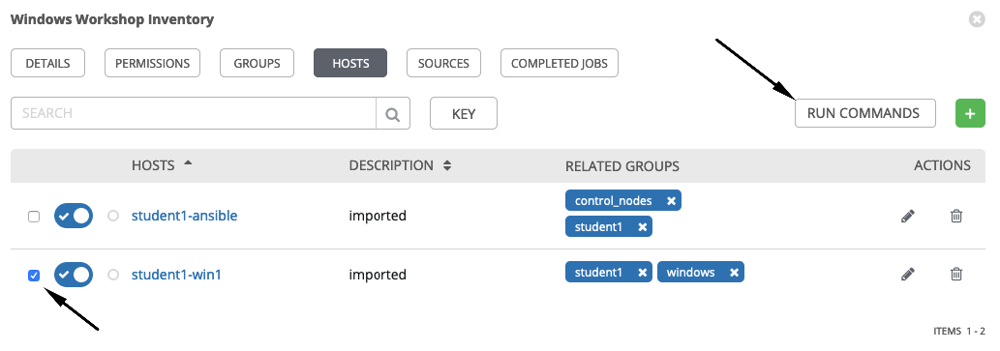
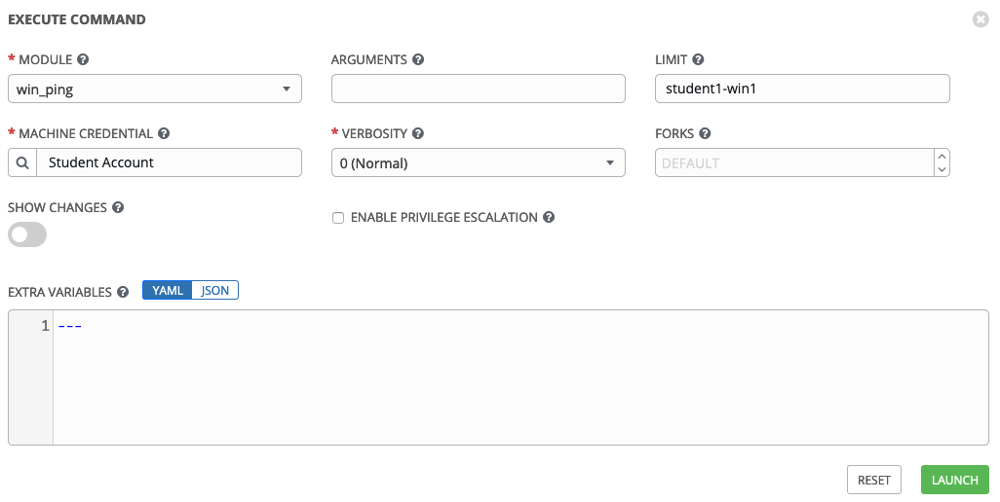
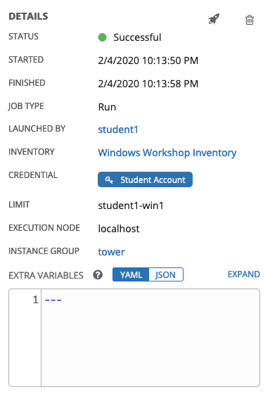
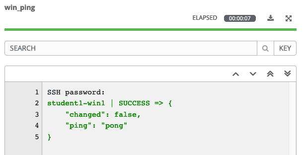
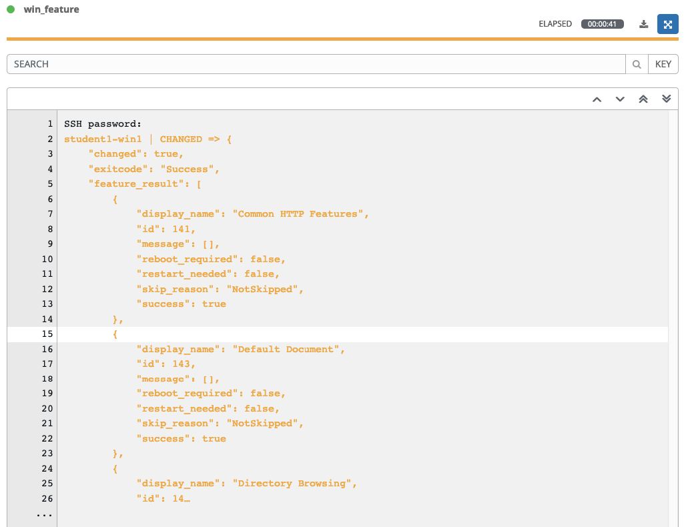
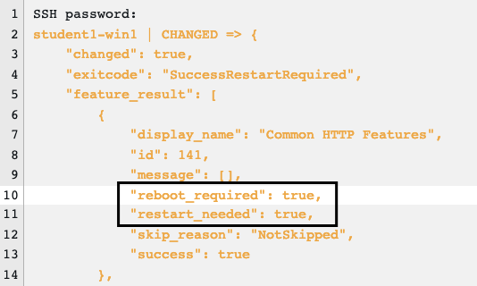

Section 1: Ad-hoc commands
==========================

Ansible Ad-Hoc commands enable you to perform tasks on remote nodes without having to write a playbook.
They are very useful when you simply need to do one or two things quickly, to many remote nodes.

Step 1:
-------

Select **Inventories** on the left panel, and then select the name of our Inventory **Workshop Inventory**. 
Now that you are on the Inventory Details page, we will select our Host. So select **HOSTS**.

Next to each host is a checkbox. Check the box next to each host you
want to run an Ad-Hoc Command on. You will then see the **RUN COMMANDS**
button become enabled. Click it now.

This will pop up the **Execute Command** window. From here is where we
can run a single task against our hosts.

The `win_ping` module makes sure our windows hosts are responsive. This is not a
traditional *ping*, but actually verifying both connectivity and
authentication to the host.

Fill out this form as follows

| Key                | Value           | Note                                                            |
|--------------------|-----------------|-----------------------------------------------------------------|
| Module             | `win_ping`      |                                                                 |
| Arguments          |                 | Intentionally blank                                             |
| Limit              |                 | This will be pre-filled out for you with the hosts you selected |
| MACHINE CREDENTIAL | Student Account |                                                                 |

Once you click **LAUNCH** you will be redirected to the Job log. Every
job and action in Ansible Tower is recorded and stored. 

The first part of the log shows you the details of the job. This
includes information such as who launched the job, against what hosts,
and when.

The second part of the job log shows you the actual output from the
command. If your connection was successful, you should see a result such
as this.

The results returned will be different depending on which module is
used, as they all handle and deal with different data sets depending on
the task. No matter which module is used, you will always see a color
coded STATUS of either SUCCESS, FAILURE, CHANGED, or SKIPPING.

Step 2:
-------

Now, let’s install IIS using the `win_feature` module. Our arguments
parameter is going to get a little more complex now.

| Key                | Value                           | Note |
|--------------------|---------------------------------|------|
| Module             | `win_feature`                   |      |
| Arguments          | `name=Web-Server state=present` |      |
| MACHINE CREDENTIAL | Student Account                 |      |

You will notice that the log text is now orange. This is to denote that
a change was made on the system versus the green that shows that no
changes were made earlier.

Step 3:
-------

Next, remove the IIS feature.

| Key                | Value                          | Note |
|--------------------|--------------------------------|------|
| Module             | `win_feature`                  |      |
| Arguments          | `name=Web-Server state=absent` |      |
| MACHINE CREDENTIAL | Student Account                |      |

And now reboot the host.

| Key                | Value           | Note                |
|--------------------|-----------------|---------------------|
| Module             | `win_reboot`    |                     |
| Arguments          |                 | Intentionally blank |
| MACHINE CREDENTIAL | Student Account |                     |

> **Note**
>
> The `win_reboot` module will cause the machine to reboot, and then will
> wait for it to come completely back up before finishing. This way, if
> you need to reboot the host in the middle of your playbook, the rest
> of the playbook will not fail because the host is inaccessible.

End Result
----------

When a task is performed on a Windows server, Ansible is smart enough to know whether a reboot is required after executing that task. The below is part of the output of the command to remove the IIS feature. The output of this task can be used in subsequent tasks, like whether or not to reboot before continuing. 

----
**Navigation**
 
[Previous Exercise](../1-tower) - [Next Exercise](../3-playbook)
