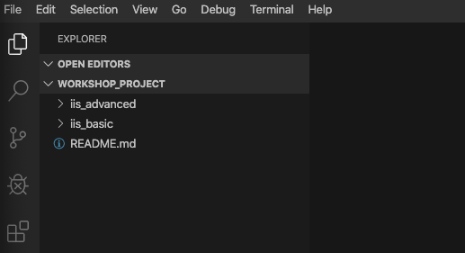
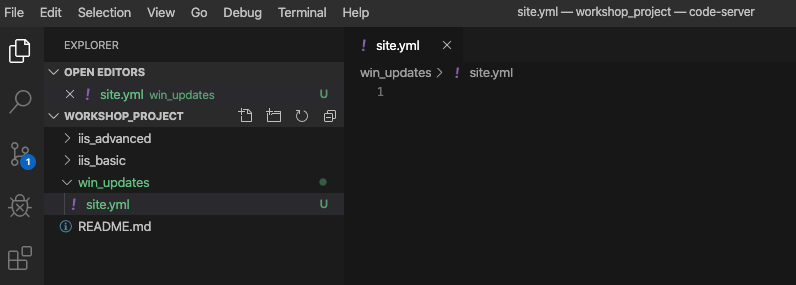
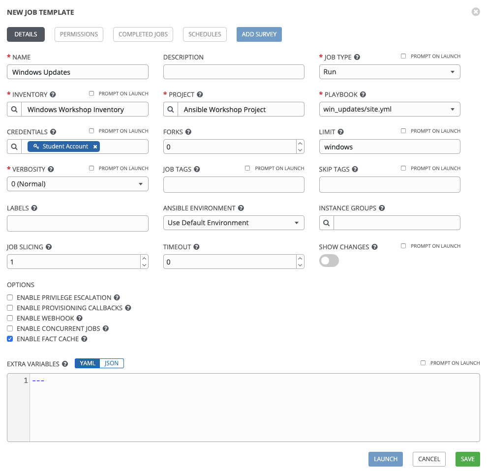
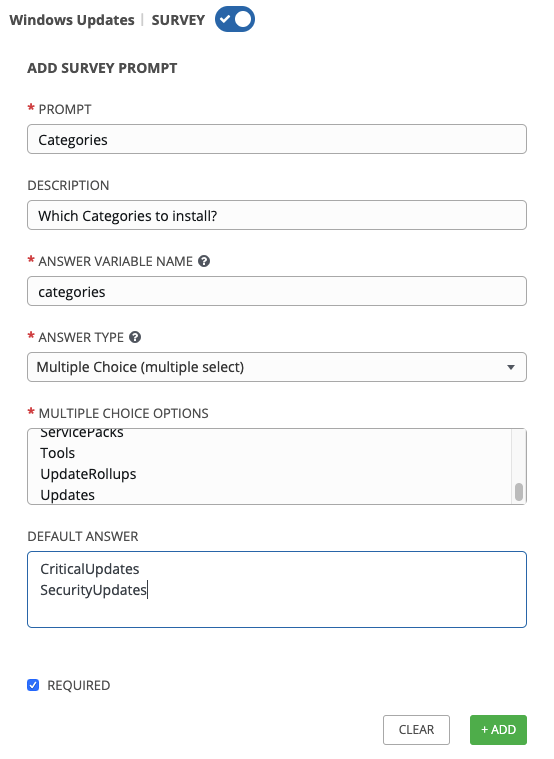
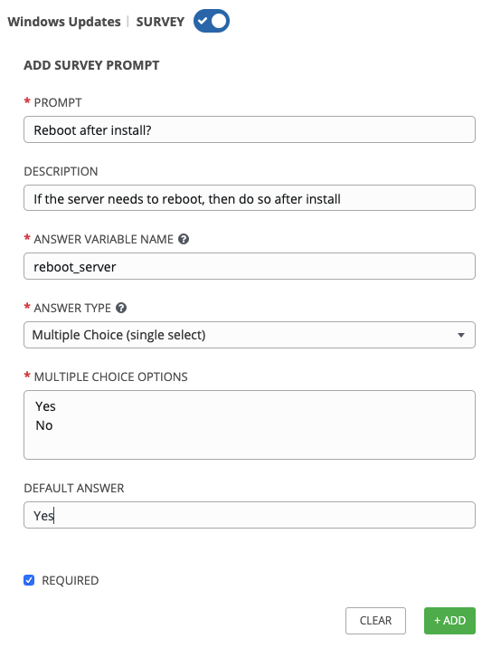

Section 1 - Creating your Playbook
==================================

The `win_updates` module is used to either check for or to install
Windows Updates. The module utilizes the built in Windows Update service
to function. This means that you still will need a backend system like
WSUS or the online Windows Update Servers to download updates from. If
your server’s Windows Update configuration is set to automatically
download but not install, you can also utilize the module to stage
updates by telling it to `search` for updates. We also have the ability
to whitelist or blacklist updates. For example we could tell it to only
install one particular security update instead of every update
available.

To begin, we are going to create a new playbook. We will be repeating
the steps you performed in the earlier exercises.

Step 1:
-------

Within Visual Studio Code, we will now create a new directory in your
git repository and create a new playbook file.

In the Explorer accordion you should have a *student\#* section where
you previously made iis\_basic.



After clicking on README.md, hover over the *WORKSHOP_PROJECT* section and click the *New Folder* button to create a folder at the root directory of your Git project. Type `win_updates` and hit enter.

Now richt-click the `win_updates` folder and click the *New File* button. Type `site.yml` and hit enter.

You should now have an editor open in the right pane that can be used
for creating your playbook.



Section 2: Write your Playbook
==============================

Edit your site.yml and add a play definition and some tasks to your
playbook. This will cover a very basic playbook for installing Windows
Updates. Typically you would have even more tasks to accomplish the
entire update process. This might entail creating service tickets,
creating snapshots, or disabling monitoring.

<!--  -->
```yaml
    ---
    - hosts: windows
      name: This is my Windows patching playbook
      tasks:
        - name: Install Windows Updates
          win_updates:
            category_names: "{{ categories | default(omit) }}"
            reboot: '{{ reboot_server | default(yes) }}'
```
<!--  -->

> **Note**
>
> **What are we doing?**
>
> -   `win_updates:` This module is used for checking or installing
>     updates. We tell it to only install updates from specific
>     categories using a variable. `reboot` attribute will automatically
>     reboot the remote host if it is required and continue to install
>     updates after the reboot. We will also use a survey variable to
>     stop us from rebooting even if needed. If the reboot\_server value
>     is not specified we will set the reboot attribute to yes.
>
Section 3: Save and Commit
==========================

Your playbook is done! But remember we still need to commit the changes
to source code control.

Click `File` → `Save All` to save the files you’ve written


Click the Source Code icon (1), type in a commit message such as *Adding
windows update playbook* (2), and click the check box above (3).


Sync to gitlab by clicking the arrows on the lower left blue bar.


It should take 5-30 seconds to finish the commit. The blue bar should
stop rotating and indicate 0 problems…

Section 4: Create your Job Template
===================================

Now, back in Tower, you will need to resync your Project so that the new
files show up.

Next we need to create a new Job Template to run this playbook. So go to
*Template*, click *Add* and select `Job Template` to create a new job
template.

Step 1:
-------

Complete the form using the following values

| Key                | Value                      | Note |
|--------------------|----------------------------|------|
| NAME               | Windows Updates            |      |
| DESCRIPTION        |                            |      |
| JOB TYPE           | Run                        |      |
| INVENTORY          | Windows Workshop Inventory |      |
| PROJECT            | Ansible Workshop Project   |      |
| Playbook           | `win_updates/site.yml`     |      |
| MACHINE CREDENTIAL | Student Account            |      |
| LIMIT              | windows                    |      |
| OPTIONS            | [*] ENABLE FACT CACHE      |      |



Step 2:
-------

Click SAVE  and then select ADD SURVEY


Step 3:
-------

Complete the survey form with following values

| Key                     | Value                                                                                                                                                  | Note                                         |
|-------------------------|--------------------------------------------------------------------------------------------------------------------------------------------------------|----------------------------------------------|
| PROMPT                  | Categories                                                                                                                                             |                                              |
| DESCRIPTION             | Which Categories to install?                                                                                                                           |                                              |
| ANSWER VARIABLE NAME    | categories                                                                                                                                             |                                              |
| ANSWER TYPE             | Multiple Choice (multiple select)                                                                                                                      | **There's also a *single* selection option** |
| MULTIPLE CHOICE OPTIONS |  Application<br>Connectors<br>CriticalUpdates<br>DefinitionUpdates<br>DeveloperKits<br>FeaturePacks Guidance<br>SecurityUpdates<br>ServicePacks<br>Tools<br>UpdateRollups<br>Updates |                                              |
| DEFAULT ANSWER          |  CriticalUpdates<br>SecurityUpdates                                                                                                                       |                                              |
| REQUIRED                | Selected                                                                                                                                               |                                              |
|                         |                                                                                                                                                        |                                              |



Once complete, click the ADD  button. You will
see your new field off to the right. Now add another field by filling
out the form on the left again.

| Key                     | Value                                                   | Note |
|-------------------------|---------------------------------------------------------|------|
| PROMPT                  | Reboot after install?                                   |      |
| DESCRIPTION             | If the server needs to reboot, then do so after install |      |
| ANSWER VARIABLE NAME    | `reboot_server`                                         |      |
| ANSWER TYPE             | Multiple Choice (single select)                         |      |
| MULTIPLE CHOICE OPTIONS | Yes<br>No                                               |      |
| DEFAULT ANSWER          | Yes                                                     |      |
| REQUIRED                | Selected                                                |      |



Step 4:
-------

Select ADD 

Step 5:
-------

Select SAVE 

Step 6:
-------

Back on the main Job Template page, select SAVE
 again.

Section 6: Running your new playbook
====================================

Now let’s run it and see how it works.

Step 1:
-------

Select TEMPLATES

> **Note**
>
> Alternatively, if you haven’t navigated away from the job templates
> creation page, you can scroll down to see all existing job templates

Step 2:
-------

Click the rocketship icon  for the
**Windows Updates** Job Template.

Step 3:
-------

When prompted, enter select the update categories. Answer `Yes` to the
*Reboot after install?* prompt and click **NEXT**.

After the job launches, you should be redirected and can watch the
output of the job in realtime.
