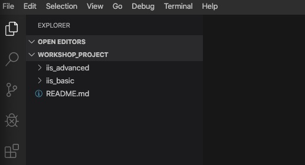
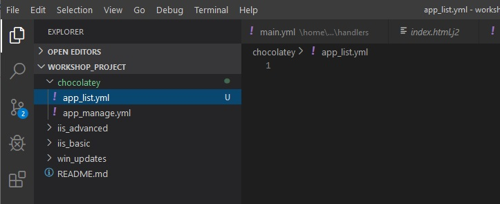
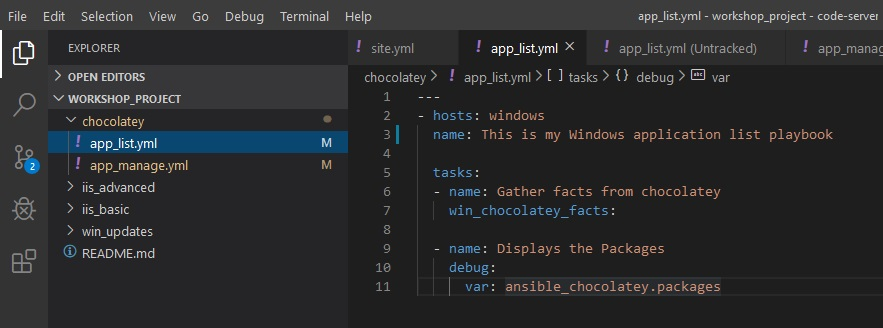
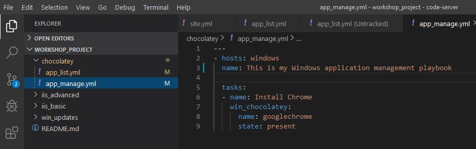
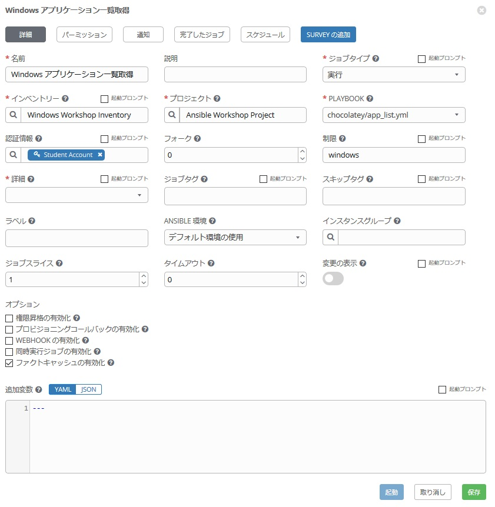
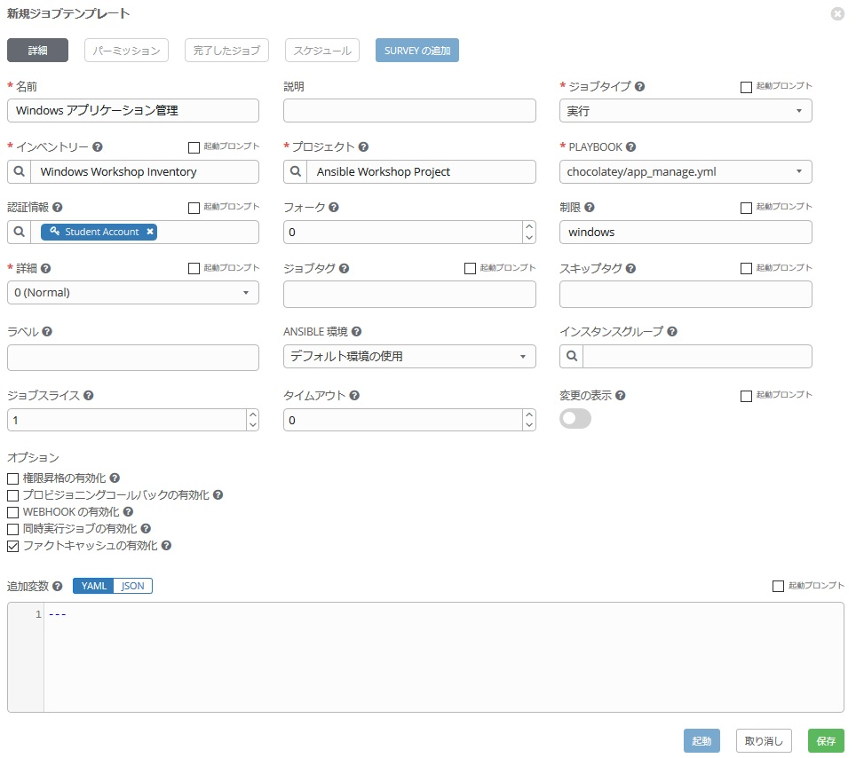
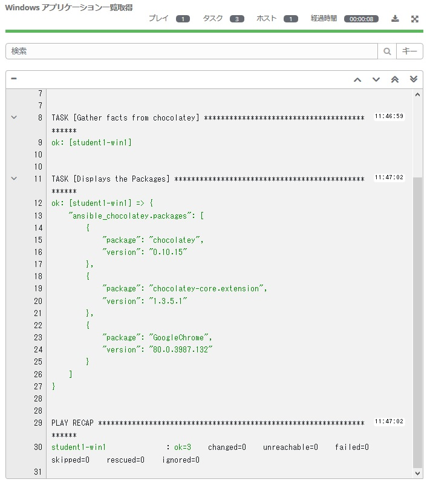

# Exercise 8 - Windows Application Management  

Another big motivation for managing Windows with Ansible is automation of application management. 

There are several ways to manage applications on Windows with Ansible. For example, the win_feature module from Exercise 2 can be used to manage applications provided by the OS. On the other hand, if it is not a function provided by the OS but by a 3rd party application, there is a module called win_package and win_chocolatey.

### Preparation 

To use Chocolatey, you need to install chocolatey software on your Windows host. Let's also automate this with Ansible. Using Exercise 2 as a reference, use the PowerShell ad hoc commands win_shellto do the following:

In Ansible Tower, Inventory → Windows Workshop Inventory → Hosts

Check　the "student1-win1 " and click "Run Command" .

On the Run Command screen, select the options below.

**Module:**  
　win_shell

**Argument:**
　 Set-ExecutionPolicy Bypass -Scope Process -Force; iex ((New-Object System.Net.WebClient).DownloadString('https://chocolatey.org/install.ps1'))

**Machine Credentials:**
　Student Account

Chocolatey is now available on your Windows host. Ready!!!

### Step 1:



After clicking on README.md, hover over the WORKSHOP_PROJECT section and click the New Folder button.

Type `win_chocolatey` and hit enter. Now, click that folder so it is selected. 

Right-click the `win_chocolatey` folder and select New File.

Type `app_list.yml` and hit enter. 

Right-click the `win_chocolatey` folder and select New File.

Type `app_manage.yml` and hit enter.



## Playbook の作成

今から二つの Playbook を作成します。

**1. app_list.yml:**  
　chocolatey 経由で管理されているアプリケーションの一覧を表示します。  
**2. app_manage.yml:**  
　アプリケーションの追加、削除、更新を行います。  

まず、1から作成してみましょう。  
`app_list.yml` の Playbook 編集用のエディターが右ペインに開いていることを確認し、以下作業を行います。  

<!--  -->
```yaml
---
- hosts: windows
  name: This is my Windows application list playbook

  tasks:
  - name: Gather facts from chocolatey
    win_chocolatey_facts:

  - name: Displays the Packages
    debug:
      var: ansible_chocolatey.packages
```
<!--  -->



> **ヒント**
>
> `win_chocolatey_facts:` chocolatey で管理するアプリケーションに関する情報を取得するモジュールです。今回は、アプリケーションインストール前後で動作させてみて、インストールされたパッケージの差異を確認します。  


次に、`app_manage.yml` をクリックして、Playbook を以下のように編集してください。    

<!--  -->
```yaml
---
- hosts: windows
  name: his is my Windows application management playbook

  tasks:
  - name: Install Chrome
    win_chocolatey:
      name: googlechrome
      state: present
```
<!--  -->



> **ヒント**
>
> `win_chocolatey:` chocolatey リポジトリと連携してアプリケーションを追加、削除、更新するモジュールです。今回はほんの一例として Googoe Chrome をインストールしてみました。他にも、`name` に `jre8` を指定すると、Javaのランタイム、そのほか、`putty`、`vscode`などと記述すれば、それぞれのアプリケーションを管理することが可能です。  

## 保存とコミット

chocolatey でアプリケーション一覧を表示させる Playbook 及び、アプリケーションの管理を行う Playbook の完成です♪  
早速、変更を保存し、GitLabにコミットしましょう。やり方は・・・、もうわかりますね？  

## ジョブテンプレートの作成

新しい Playbook を作成しましたので、Ansible Tower の GUI に戻ってプロジェクトの同期を行ってください。  
次に、このプレイブックを実行する新しいジョブテンプレートを作成する必要があります。*テンプレート*に移動して*追加*をクリックし、`ジョブテンプレート`を選択して新しいジョブテンプレートを作成します。

### 1. app_list.yml 用のジョブテンプレート作成  

次の値を使用してフォームに入力します。  

| キー                | 値                      | 備考 |
|--------------------|----------------------------|------|
| 名前               |Windows アプリケーション取得           |      |
| 説明        |                            |      |
| ジョブタイプ           | 実行                        |      |
| インベントリー          | Windows Workshop Inventory |      |
| プロジェクト            | Ansible Workshop Project   |      |
| PLAYBOOK           | `chocolatey/app_list.yml`     |      |
| 認証情報 | Student Account            |      |
| 制限              | windows                    |      |
| オプション            | [*] ファクトキャッシュの有効化にチェック      |      |



保存をクリックします。  

### 2. app_manage.yml 用のジョブテンプレート作成  

同様にして、アプリケーション管理のジョブテンプレートを作成します。  

値は下記参照ください。    

| キー                | 値                      | 備考 |
|--------------------|----------------------------|------|
| 名前               |Windows アプリケーション管理|      |
| 説明        |                            |      |
| ジョブタイプ           | 実行                        |      |
| インベントリー          | Windows Workshop Inventory |      |
| プロジェクト            | Ansible Workshop Project   |      |
| PLAYBOOK           | `chocolatey/app_manage.yml`     |      |
| 認証情報 | Student Account            |      |
| 制限              | windows                    |      |
| オプション            | [*] ファクトキャッシュの有効化にチェック      |      |



### Playbook の起動

作成した Playbook を以下の順番に実行してみて、表示内容を確認してみましょう♬  

1. `Windows アプリケーション一覧取得` ジョブテンプレートの起動
2. `Windows アプリケーション管理` ジョブテンプレートの起動
3. `Windows アプリケーション一覧取得` ジョブテンプレートの起動

どうなりましたでしょうか？Chromeは追加でインストールされましたか？  
インストールされると、以下のように表示されると思います。  



今回は演習を簡略化するため変数は使いませんでしたが、アプリケーション管理のところで、state オプションを変数化し、present/absent/latest を選択できるようにしておくと追加、削除、更新が実行時に選択出来て便利かもしれません。また、アプリケーションの一覧をcsv化して、そのファイルを読み込んできて複数のアプリケーションを一気にインストールなどということももちろん可能です。便利ですね。♬  

これでオプションのハンズオンも終了です！お疲れさまでした！！  
