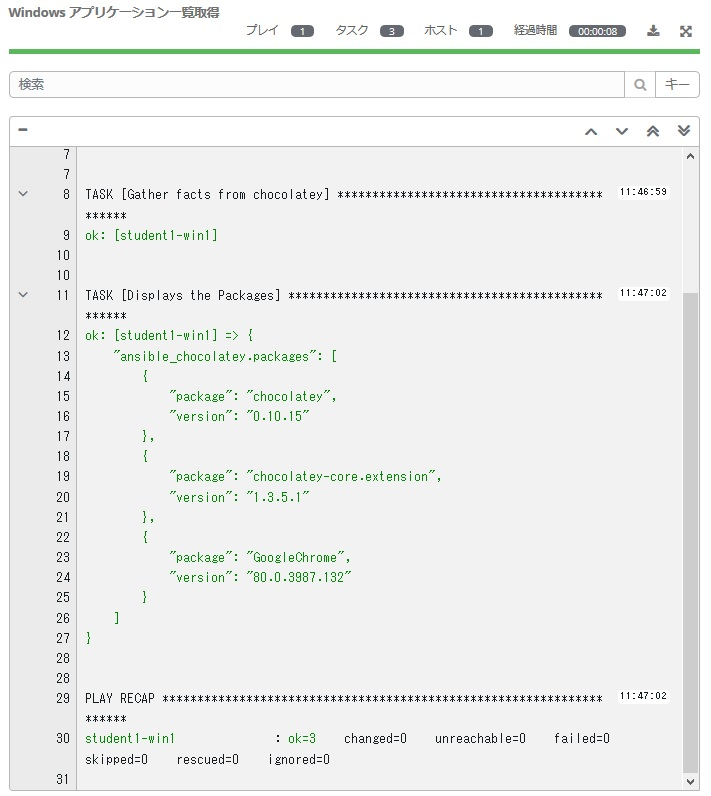

# Exercise 8 - Windows Application Management  

Another big motivation for managing Windows with Ansible is automation of application management. 


### Preparation 

To use Chocolatey, you need to install chocolatey software on your Windows host. Let's also automate this with Ansible. Using Exercise 2 as a reference, use the PowerShell ad hoc commands `win_shell` to do the following:

In Ansible Tower, Inventory → Windows Workshop Inventory → Hosts

Check　the **studentX-win1** box and click "Run Command" .

On the Run Command screen, select the options below.

| Key                | Value           | Note                                                            |
|--------------------|-----------------|-----------------------------------------------------------------|
| Module             | `win_shell`      |                                                                 |
| Arguments          |                 | Set-ExecutionPolicy Bypass -Scope Process -Force; iex ((New-Object System.Net.WebClient).DownloadString('https://chocolatey.org/install.ps1'))                                            |
| Limit              |                 | This will be pre-filled out for you with the hosts you selected |
| MACHINE CREDENTIAL | Student Account |                                                                 |


Chocolatey is now available on your Windows host. Ready!!!

### Step 1:


After clicking on README.md, hover over the WORKSHOP_PROJECT section and click the New Folder button.

Type `win_chocolatey` and hit enter. Now, click that folder so it is selected. 

Right-click the `win_chocolatey` folder and select New File.

Type `app_list.yml` and hit enter. 

Right-click the `win_chocolatey` folder and select New File.

Type `app_manage.yml` and hit enter.


## Creating a playbook

We are going to create two playbooks now.

1. app_list.yml:
　Display a list of applications managed via chocolatey.
2. app_manage.yml:
　Add, remove and update applications.

First, let's create from app_list.yml
Make sure that the editor for editing the Playbook is open in the right pane and do the following:

<!--  -->
```yaml
---
- hosts: windows
  name: This is my Windows application list playbook

  tasks:
  - name: Gather facts from chocolatey
    win_chocolatey_facts:

  - name: Displays the Packages
    debug:
      var: ansible_chocolatey.packages
```
<!--  -->


> **Tips**
>
> `win_chocolatey_facts:` This module gets information about applications managed by chocolatey. This time, try running it before and after installing the application to check the differences in the installed packages.


Then、`app_manage.yml` click on and edit the playbook as follows:   

<!--  -->
```yaml
---
- hosts: windows
  name: his is my Windows application management playbook

  tasks:
  - name: Install Chrome
    win_chocolatey:
      name: googlechrome
      state: present
```
<!--  -->


> **Tips**
>
> `win_chocolatey:` A module that adds, deletes, and updates applications in cooperation with the chocolatey repository. This time we installed Google Chrome as an example. 

## Save and commit

The playbook that displays the application list with chocolatey and the playbook that manages the application are complete. Save your changes and commit to GitLab like in the previous exercises.  

## Creating a job template

Now that you have created a new playbook, go back to the Ansible Tower GUI and sync your project.
Next, you need to create a new job template to run this playbook. Go to Templates , click Add and select Job Template to create a new job template.

### 1. Creating a job template for app_list.yml

Fill out the form with the following values:  

| Key                | Value                      | Remarks |
|--------------------|----------------------------|------|
| name               | Windows Application List           |      |
| Job type           | Run                        |      |
| Inventory          | Workshop Inventory         |      |
| Project            | Ansible Workshop Project   |      |
| Playbook           | `chocolatey/app_list.yml`     |      |
| Credentials | Student Account            |      |
| Limit              | windows                    |      |
| Options            | 	[*] Check to enable fact cache      |      |

Click Save 

### 2. Creating a job template for app_manage.yml 

Similarly, create an application management job template.

See below for values.    

| Key                | Value                      | Remarks |
|--------------------|----------------------------|------|
| Name               | Windows Application Management |      |
| Job Type           | Execution                        |      |
| Inventory          | Workshop Inventory          |      |
| Project            | Ansible Workshop Project   |      |
| Playbook           | `chocolatey/app_manage.yml`     |      |
| Credentials | Student Account            |      |
| Limit              | windows                    |      |
| options            | [*] Check to enable fact cache     |      |


### Launch Playbook

Let's run the created Playbook in the following order and check the displayed contents 

1. Windows Application List
2. Windows Application Management

What happened? Was Chrome additionally installed?
Once installed, you should see something like this:



This completes the Lab 8! Thank you for your hard work! !!
